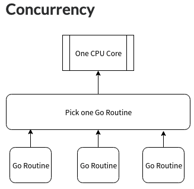
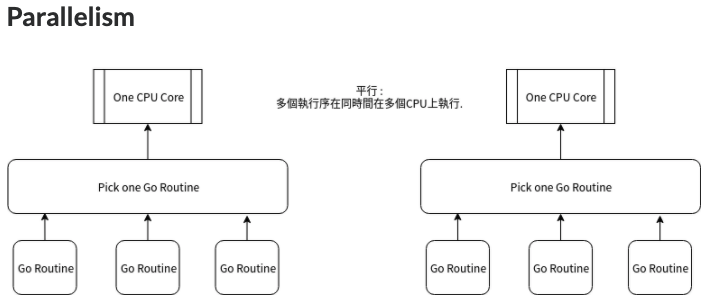

# Gotoutine

### 併發(Concurrency)

### 平行(Parallelism)

### 特性

- 實踐的是併發(Concurrency)並不是平行(Parallelism)
    - 在單一核心的情況下，效能提昇並不明顯。
- 創件一個 Goroutine 的資源消耗小。
    - 目前收集到一個不做任何事情的 Goroutine 平均是 3-4 kb，網路上有人實際測試為 7-9 kb。
    - 若假設平均一個為 5 kb 的話，1 gb 可以有 20000 個 Gorutine 執行
    - 要管理個上千上萬個 Goroutine 時，相對於其他語言比較不佔記憶體
- 同步模型是用 CSP 在 Goroutine 之間傳遞訊息，而不是透過對資料加上 lock 來做同步存取
    - CSP (Communicating Sequential Process)，一種訊息傳遞模式